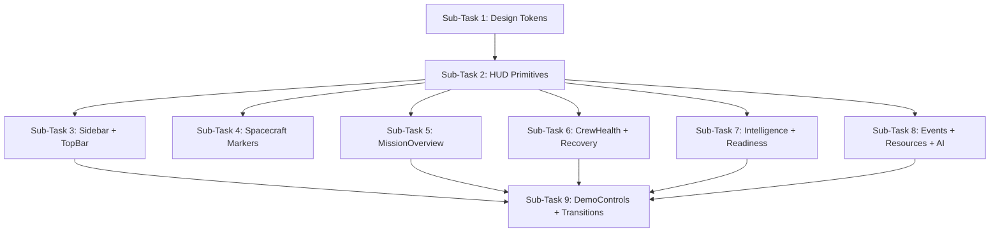

# CosmoCare — Holographic HUD Redesign Plan

## Overview

Redesign the CosmoCare frontend from a dark-card dashboard into a **spatial holographic HUD** where
translucent panels float over and around the 3D spacecraft. All existing functionality, data, routing,
context, AI engine, and 3D interactions are preserved exactly. Only the visual layer changes.

**North star aesthetic:** Deep-space medical command interface. The spacecraft is the physical
environment. The UI is the intelligence layer hovering above it.

**Anti-goals:** Generic glassmorphism, gaming HUD, cyberpunk neon, or removing any existing feature.

---

## Architecture at a Glance

```
globals.css ──────────────── Design tokens + layout primitives
HUDComponents.tsx (new) ────  Reusable HUD primitives (glass panels, corner brackets, etc.)
Sidebar.tsx ─────────────── Semi-transparent HUD rail
TopBar.tsx ──────────────── Floating minimal bar
SpacecraftViewer.tsx ───────  Holographic crew markers (enhanced)
MissionOverview.tsx ────────  Full-bleed layout, panels overlay spacecraft
All other views ─────────── HUD glass panels, HUD charts, HUD controls
```

---

## Sub-Tasks

---

### Sub-Task 1 — Design Tokens & Global CSS Foundation

**Status:** [ ] pending

**Intent**
Replace the existing opaque-card design tokens in `globals.css` with the holographic HUD token set.
This is the foundation everything else builds on. Doing it first means subsequent sub-tasks only
need to reference the new tokens without re-deriving colors.

**Expected Outcomes**
- New CSS variables in `:root` covering the 3-level glass system, holographic accent colors,
  depth shadows, and animation keyframes.
- Existing `.card`, `.sidebar`, `.topbar`, `.nav-item` classes updated to use the new tokens.
- Background changes to near-black `#020408` with a faint navy tint.
- New utility keyframe animations: `hud-pulse`, `hud-scan`, `status-fade`.
- No visual regressions on un-touched components (they still compile and render).

**Todo List**
1. Update `:root` with new design tokens:
   - `--bg: #020408` (near-black space)
   - `--hud-glass-1` through `--hud-glass-3` (3 opacity levels: 0.18 / 0.38 / 0.55)
   - `--hud-border`: `rgba(255,255,255,0.08)`
   - `--hud-border-accent`: `rgba(77,232,208,0.35)` (cyan)
   - `--hud-glow`: `rgba(0,180,255,0.06)`
   - `--accent-cyan: #4DE8D0`, `--accent-teal: #39D9FF`
   - Keep status colors: GREEN `#34d399`, YELLOW `#fbbf24`, ORANGE `#fb923c`, RED `#f87171`
   - Keep `--text`, `--text-muted`, `--text-dim` (readable contrast preserved)
2. Rewrite `.card` as the Level 2 glass panel base class.
3. Add `.hud-glass-1`, `.hud-glass-2`, `.hud-glass-3` utility classes.
4. Add `.hud-bracket` pseudo-element pattern (corner tick marks via `::before`/`::after`).
5. Update `.sidebar` to semi-transparent (Level 1 glass, no background fill).
6. Update `.topbar` to ultra-thin floating bar (Level 1 glass, very low opacity border).
7. Update `.nav-item.active` to cyan left-edge accent + slightly increased opacity.
8. Add keyframes: `hud-pulse` (opacity 0.6→1.0), `hud-scan` (translateY subtle scan line),
   `status-fade` (color cross-fade for scenario transitions).
9. Add `.hud-btn` class for HUD-style controls (thin border, transparent bg, corner accents on hover).
10. Verify Inter font and scrollbar styles carry forward unchanged.

**Relevant Context**
- [`src/app/globals.css`](src/app/globals.css) — full file, replace in place
- `--accent-cyan` already exists (`#06b6d4`); upgrade to `#4DE8D0`
- `frontend-plan.md` §3, §4, §8, §21

---

### Sub-Task 2 — Reusable HUD Primitive Components

**Status:** [x] done

**Intent**
Create a new file `src/components/HUDComponents.tsx` containing small, composable React components
that implement the recurring HUD visual patterns. Views consume these instead of re-implementing the
same patterns. Keeps styling consistent and reduces per-view effort.

**Expected Outcomes**
- `HUDPanel` — wrapper applying one of the 3 glass levels + optional corner brackets.
- `HUDBracket` — renders 4 small CSS corner tick marks (cyan SVG lines, not borders).
- `HUDLabel` — uppercase 10px tracking label with optional cyan leading dot.
- `HUDMetricValue` — large value + small unit, styled for telemetry readability.
- `HUDStatusDot` — pulsing status indicator (color-coded GREEN/YELLOW/ORANGE/RED).
- `HUDDivider` — 1px line with subtle glow, replaces opaque `border-bottom`.
- `HUDChart` — thin wrapper for Recharts `LineChart` that enforces transparent bg, glowing stroke,
  minimal grid, and removes all opaque fills.
- `CommDelayBanner` — holographic system notification that appears when Earth link is delayed
  (replaces current plain yellow banner).

**Todo List**
1. Create `src/components/HUDComponents.tsx`.
2. Implement `HUDPanel` with `level` prop (1 | 2 | 3), `brackets` boolean, optional `glowColor`.
3. Implement `HUDBracket` as an absolutely-positioned 4-corner SVG overlay.
4. Implement `HUDLabel` with dot variant and no-dot variant.
5. Implement `HUDMetricValue` — value + unit side by side, value large/bright, unit small/muted.
6. Implement `HUDStatusDot` applying `hud-pulse` animation to status-colored dot.
7. Implement `HUDDivider` with `rgba(77,232,208,0.12)` color.
8. Implement `HUDChart` — wraps `LineChart`, forces `background: transparent`, adds glowing
   `stroke` via Recharts `stroke` prop, removes `CartesianGrid` fill, minimal tick labels.
9. Implement `CommDelayBanner` — renders as a Level 1 glass panel with amber/yellow accent border,
   ⚠ icon, delay time, and "LOCAL DECISION SUPPORT ACTIVE" sub-label.
10. Export all components.

**Relevant Context**
- `frontend-plan.md` §3, §4, §6, §12, §13, §14, §15, §19
- Recharts already installed; `HealthIntelligence.tsx` has the existing chart patterns to mirror
- No new dependencies needed

---

### Sub-Task 3 — Sidebar & TopBar

**Status:** [ ] pending

**Intent**
Transform `Sidebar.tsx` into a translucent HUD navigation rail and `TopBar.tsx` into a minimal
floating bar. These two components frame every view so they establish the HUD tone immediately.

**Expected Outcomes**
- Sidebar: semi-transparent background, no heavy border, cyan accent on active nav item,
  thin illuminated left edge for active state.
- TopBar: ultra-thin bar, left logo + subtitle, center mission name + day, right Earth comm + alerts,
  `CommDelayBanner` swaps in when comm status changes.
- All existing nav items, crew selector, comm status, emergency indicator remain functional.

**Todo List**
1. **Sidebar** (`src/components/Sidebar.tsx`):
   - Replace `background: var(--surface)` with `--hud-glass-1` glass.
   - Replace `border-right` with `1px solid var(--hud-border)`.
   - Logo area: "COSMOCARE" in small caps + version, remove heavy box.
   - Nav items: apply `.nav-item` updates from Sub-Task 1 (cyan left edge + subtle bg on active).
   - Crew status list: use `HUDStatusDot` per astronaut.
   - Medical events badge: keep RED count badge, apply `hud-glass-3` + red glow border.
2. **TopBar** (`src/components/TopBar.tsx`):
   - Replace opaque `background: var(--surface)` with `--hud-glass-1` + `backdrop-filter: blur(10px)`.
   - Left section: "COSMOCARE" + "Mission Command · 3D Health View" sub-label.
   - Center section: mission name (ARTEMIS FORWARD) + DAY counter, thin separator lines.
   - Right section: Earth comm indicator → swap to `CommDelayBanner` inline when delayed.
   - Emergency indicator: retain pulse-red; wrap in subtle red-glow `HUDPanel level=3`.
   - Crew selector buttons: apply `.hud-btn` style.
3. Use `HUDLabel`, `HUDStatusDot`, `CommDelayBanner` from HUDComponents.

**Relevant Context**
- [`src/components/Sidebar.tsx`](src/components/Sidebar.tsx) — currently opaque `#0d1320`
- [`src/components/TopBar.tsx`](src/components/TopBar.tsx) — currently opaque `#0d1320`
- `AppContext` `commStatus` drives delay display; no logic changes
- `frontend-plan.md` §16, §17, §19

---

### Sub-Task 4 — SpacecraftViewer: Holographic Crew Markers

**Status:** [ ] pending

**Intent**
Upgrade the `CrewMarker` component inside `SpacecraftViewer.tsx` to feel holographic:
pulsing glow, vertical locator beam, floating name label, and smooth camera focus on selection.
The existing drag/click/select logic must remain identical.

**Expected Outcomes**
- Each crew marker: colored pulsing ring + soft status-color glow sphere.
- Thin vertical beam (`<Line>` from drei) extending upward from marker position.
- Floating `<Html>` label beside each marker: astronaut name + status dot.
- On hover: glow intensity increases, label becomes fully opaque.
- On selection: marker brightens, camera smoothly lerps toward that astronaut's position
  (using `SceneCameraRig` which already has lerp infrastructure).
- Stars background remains; no new post-processing passes (performance constraint).

**Todo List**
1. In `CrewMarker`:
   - Replace plain sphere with layered mesh: inner solid sphere (small, bright) + outer transparent
     pulsing ring sphere.
   - Add `pointLight` at marker position, intensity keyed to health status severity.
   - Add vertical `<Line>` (thin, status-colored, 80% opacity) from marker up ~0.3 units.
   - Add `<Html>` floating label: name + role abbreviation + `HUDStatusDot` (rendered as HTML
     overlaid on canvas via drei Html component).
   - Animate pulse with `useFrame` — scale the outer ring between 1.0 and 1.15 on a ~2s cycle.
2. On hover (`onPointerEnter`/`onPointerLeave`): increase `pointLight` intensity, set label opacity
   to 1.0 (from 0.7).
3. On selection: `SceneCameraRig` already lerps; ensure selected marker gets a second outer ring
   with a brighter cyan glow (additional `<mesh>` with `MeshBasicMaterial` wireframe=false,
   transparent, opacity cycling).
4. Do NOT add EffectComposer passes or new post-processing (perf constraint from §23).
5. Keep `CREW_POSITIONS` record and drag infrastructure untouched.

**Relevant Context**
- [`src/components/SpacecraftViewer.tsx`](src/components/SpacecraftViewer.tsx) — `CrewMarker`
  function at line 247, `SceneCameraRig` at line 495
- `@react-three/drei` `Line` and `Html` components already available
- `frontend-plan.md` §10, §11, §23

---

### Sub-Task 5 — MissionOverview Layout: Full-Bleed HUD

**Status:** [ ] pending

**Intent**
`MissionOverview` is the most important view — it is where the spacecraft + UI relationship is most
visible. The current layout uses opaque side panels that cover the spacecraft. Redesign it so the
spacecraft fills the entire viewport and the crew/health panels overlay it as transparent HUD layers.

**Expected Outcomes**
- Spacecraft canvas is full-bleed (fills the entire content area, behind everything).
- Left HUD panel (crew status + habitat telemetry) floats as an absolute-positioned glass overlay,
  not a flex column that shrinks the canvas.
- Right HUD panel (crew detail / alerts) floats as an absolute-positioned glass overlay on the right.
- Center bottom: mission label + crew status legend, floating as Level 1 glass.
- All 4 crew cards still render with health/recovery/readiness pills, sparklines, and click-to-select.
- Panels use `HUDPanel level=2` + corner brackets.
- Habitat telemetry uses `HUDLabel` + `HUDMetricValue`.
- The spacecraft remains visible through the panels.

**Todo List**
1. Change `MissionOverview` root to `position: relative; width: 100%; height: 100%; overflow: hidden`.
2. Move `SpacecraftViewer` to fill 100% × 100% (absolute, `z-index: 0`).
3. Left panel: `position: absolute; left: 16px; top: 16px; bottom: 16px; width: 260px; z-index: 10`,
   wrapped in `HUDPanel level=2 brackets`.
4. Right panel: `position: absolute; right: 16px; top: 16px; bottom: 16px; width: 240px; z-index: 10`,
   wrapped in `HUDPanel level=2 brackets`.
5. Mission label: `position: absolute; top: 16px; left: 50%; transform: translateX(-50%)`, Level 1.
6. Crew status legend: `position: absolute; bottom: 16px; left: 50%; transform: translateX(-50%)`,
   Level 1 glass pill row.
7. Update crew cards inside left panel to use `HUDStatusDot`, `HUDMetricValue`, `HUDDivider`.
8. Update alerts section (right panel, no crew selected) to use `HUDPanel level=3` per alert.
9. Ensure `DemoControls` still renders above everything (`z-index: 50`).
10. Verify comm delay banner renders correctly at top-center when active.

**Relevant Context**
- [`src/components/views/MissionOverview.tsx`](src/components/views/MissionOverview.tsx)
- `SpacecraftViewer` is already dynamically imported with SSR disabled — keep that pattern
- `frontend-plan.md` §9, §11, §12, §21

---

### Sub-Task 6 — CrewHealth & RecoveryView: HUD Telemetry Panels

**Status:** [ ] pending

**Intent**
Apply the HUD visual system to `CrewHealth.tsx` and `RecoveryView.tsx`. These are the most
data-dense views. The goal is readable holographic telemetry — transparent panels, glowing metric
values, HUD charts — without making them unreadable.

**Expected Outcomes**
- All `.card` containers replaced with `HUDPanel` at appropriate levels.
- Metric rows use `HUDMetricValue` for values, `HUDLabel` for section headers, `HUDDivider` for
  separators.
- Sparklines: transparent background, single glowing line, no opaque fill.
- Recovery gauge: keep SVG circle, add subtle glow stroke color matching health status.
- Alert cards: `HUDPanel level=3` with colored glow border (risk-level color).
- `HUDBracket` on the astronaut header card (top of CrewHealth).
- Symptom bars: thin, glowing fill line instead of solid bar.

**Todo List**
1. **CrewHealth** (`src/components/views/CrewHealth.tsx`):
   - Header card → `HUDPanel level=3 brackets`.
   - Alert cards → `HUDPanel level=3` + left border glow in risk color.
   - Section cards (primary vitals, activity, environmental) → `HUDPanel level=2`.
   - Metric row sparklines → pass `transparent: true` variant or inline `background: transparent`.
   - Cognitive/recovery cards (right column) → `HUDPanel level=2`.
   - Symptom bars → replace `.metric-bar-fill` solid color with glow-colored thin fill.
2. **RecoveryView** (`src/components/views/RecoveryView.tsx`):
   - Large recovery gauge card → `HUDPanel level=3 brackets`.
   - Gauge SVG: add `filter: drop-shadow(0 0 6px <statusColor>)` on the stroke arc.
   - Status summary card → `HUDPanel level=2`.
   - 4-metric grid cards → `HUDPanel level=1`.
   - Metric sparklines → transparent background.

**Relevant Context**
- [`src/components/views/CrewHealth.tsx`](src/components/views/CrewHealth.tsx)
- [`src/components/views/RecoveryView.tsx`](src/components/views/RecoveryView.tsx)
- `frontend-plan.md` §12, §14, §18

---

### Sub-Task 7 — HealthIntelligence & MissionReadiness: HUD Chart Panels

**Status:** [ ] pending

**Intent**
Apply the HUD system to `HealthIntelligence.tsx` and `MissionReadiness.tsx`. The focus here is on
making charts feel like holographic medical monitors and the readiness gauge feel like a mission
clearance display.

**Expected Outcomes**
- Risk summary box: `HUDPanel level=3`, animated cyan/amber border, contributing factors with
  directional arrows (↑↓) as holographic indicators.
- 4 trend charts: use `HUDChart` wrapper (transparent bg, glowing line, minimal grid, baseline
  reference zone shaded very faintly).
- Educational panel: `HUDPanel level=1` with subtle scan-line animation.
- Readiness: activity selector becomes `.hud-btn` radio buttons.
- Readiness gauge: same SVG approach as RecoveryView + glow.
- WhatIf simulation panel: `HUDPanel level=1`, numerical scores as `HUDMetricValue`.

**Todo List**
1. **HealthIntelligence** (`src/components/views/HealthIntelligence.tsx`):
   - Risk summary card → `HUDPanel level=3 brackets` + left accent bar in risk color.
   - Contributing factors list: prepend ↑/↓ arrows, use `HUDLabel`.
   - 4 chart cards → `HUDChart` (transparent area fill, glowing stroke line, `--accent-cyan`).
   - Baseline reference: `ReferenceLine` with dashed `rgba(255,255,255,0.15)` stroke.
   - Educational panel → `HUDPanel level=1` + add `hud-scan` pseudo-element animation.
2. **MissionReadiness** (`src/components/views/MissionReadiness.tsx`):
   - Activity selector buttons → `.hud-btn` with active state glow.
   - Evaluation result card → `HUDPanel level=3 brackets`.
   - Readiness gauge SVG → glow stroke matching readiness status color.
   - Contributing factors → `HUDPanel level=2`, factor items with `HUDDivider`.
   - WhatIf panel → `HUDPanel level=1`, score values as `HUDMetricValue`.

**Relevant Context**
- [`src/components/views/HealthIntelligence.tsx`](src/components/views/HealthIntelligence.tsx)
- [`src/components/views/MissionReadiness.tsx`](src/components/views/MissionReadiness.tsx)
- Recharts `ReferenceLine` already used in HealthIntelligence
- `frontend-plan.md` §13, §14, §15

---

### Sub-Task 8 — MedicalEvents, MedicalResources, AIAssistant: HUD Panels

**Status:** [ ] pending

**Intent**
Apply the HUD visual system to the remaining three views. These are information-heavy and less
chart-centric. Focus on readable glass panels, HUD controls for actions, and the emergency banner
becoming a visually intense (but not full-screen-flashing) red HUD alert.

**Expected Outcomes**
- Emergency banner: `HUDPanel level=3` with red glow border + `hud-pulse` animation on border,
  not entire component.
- Event list cards: `HUDPanel level=2` with severity-colored left accent, status badge as
  `HUDStatusDot` variant.
- Event detail panel: `HUDPanel level=3`, sections divided by `HUDDivider`.
- Emergency support action items: ordered list in `HUDPanel level=2`, each item numbered with
  cyan accent.
- Medical resources: category headers as `HUDLabel`, inventory cards as `HUDPanel level=1`.
  Stock bar → thin glowing fill line.
- AI Assistant: input field styled as HUD text input (thin border, transparent bg, cyan focus ring).
  Suggested query buttons → `.hud-btn`. Result card → `HUDPanel level=3 brackets`.

**Todo List**
1. **MedicalEvents** (`src/components/views/MedicalEvents.tsx`):
   - Emergency banner → `HUDPanel level=3` with red glow + pulse on border only.
   - Event list container → scroll area with `HUDPanel level=1` wrapper.
   - Each event card → `HUDPanel level=2` with severity-color left border.
   - Detail pane → `HUDPanel level=3 brackets`.
   - Emergency support section → `HUDPanel level=2` per action block.
2. **MedicalResources** (`src/components/views/MedicalResources.tsx`):
   - Summary stat cards → `HUDPanel level=1`.
   - Category sections → `HUDLabel` headers.
   - Each item card → `HUDPanel level=1`; stock bar → glow fill.
   - Depleted items → dim opacity + red accent border.
3. **AIAssistant** (`src/components/views/AIAssistant.tsx`):
   - Input + button → HUD text field + `.hud-btn` submit.
   - Suggested query buttons → `.hud-btn` grid.
   - Query result → `HUDPanel level=3 brackets` with confidence as `HUDMetricValue`.
   - History items → `HUDPanel level=1`.
   - Loading state → `hud-scan` animation.

**Relevant Context**
- [`src/components/views/MedicalEvents.tsx`](src/components/views/MedicalEvents.tsx)
- [`src/components/views/MedicalResources.tsx`](src/components/views/MedicalResources.tsx)
- [`src/components/views/AIAssistant.tsx`](src/components/views/AIAssistant.tsx)
- `frontend-plan.md` §15, §18

---

### Sub-Task 9 — DemoControls & Scenario Transition Animations

**Status:** [ ] pending

**Intent**
Style `DemoControls.tsx` as a compact HUD control cluster and add CSS transition animations so
that scenario switches animate rather than snap — numbers counting, status badges cross-fading,
alerts sliding in. This is the final polish layer.

**Expected Outcomes**
- DemoControls panel: `HUDPanel level=2 brackets`, compact, minimal.
- Scenario buttons → `.hud-btn` with corner accents; active scenario button slightly brighter.
- Comm simulation controls → `.hud-btn`.
- Status badges use `status-fade` CSS transition (0.4s) so color changes animate.
- Metric values use CSS `transition: color 0.4s` so number color changes animate.
- Alert panels use `slideInFromTop 0.3s ease` keyframe when they appear.
- `HUDStatusDot` already pulses; ensure status color changes also cross-fade.
- No JavaScript animation libraries needed — CSS transitions only.

**Todo List**
1. **DemoControls** (`src/components/DemoControls.tsx`):
   - Outer panel → `HUDPanel level=2 brackets`.
   - All buttons → `.hud-btn`.
   - Section label → `HUDLabel`.
2. Add CSS keyframe `slideInFromTop` to `globals.css`.
3. Add `transition: color 0.4s ease, border-color 0.4s ease, background 0.4s ease` to:
   - `.alert-badge`
   - `.hud-status-dot`
   - `.hud-metric-value` (value text color)
4. Alert cards: add `animation: slideInFromTop 0.3s ease` on mount (CSS class toggle or
   always-on for simplicity via `:not(:first-child)` targeting is acceptable).
5. Verify all 4 scenario transitions look smooth end-to-end.

**Relevant Context**
- [`src/components/DemoControls.tsx`](src/components/DemoControls.tsx)
- `AppContext` `triggerScenario` remains unchanged; animations are pure CSS
- `frontend-plan.md` §20, §22

---

## Dependency Map



Sub-Tasks 3–8 can proceed in parallel once Sub-Tasks 1 and 2 are done.

---

## Constraints & Guardrails

| Constraint | Source |
|---|---|
| No new npm packages (use existing drei, recharts, CSS) | Performance + simplicity |
| No additional post-processing passes on the 3D canvas | `frontend-plan.md` §23 |
| `backdrop-filter` used selectively, not on dozens of elements simultaneously | §23 |
| All existing context, reducers, aiEngine, data unchanged | Preserve functionality |
| All 8 navigation sections remain; no routing changes | Preserve functionality |
| Status color meanings (GREEN/YELLOW/ORANGE/RED) unchanged | §8 |
| No full-screen flashing on emergency | §18 |
| No cyberpunk neon or rainbow gradients | §25 |
| Desktop primary; basic responsive fallback for smaller screens | §24 |

---

## Files That Change

| File | Change Type |
|---|---|
| `src/app/globals.css` | Full rewrite (tokens + new classes) |
| `src/components/HUDComponents.tsx` | New file |
| `src/components/Sidebar.tsx` | Styling update |
| `src/components/TopBar.tsx` | Styling update |
| `src/components/DemoControls.tsx` | Styling update |
| `src/components/SpacecraftViewer.tsx` | CrewMarker enhancements |
| `src/components/views/MissionOverview.tsx` | Full-bleed layout + HUD panels |
| `src/components/views/CrewHealth.tsx` | HUD panel/metric styling |
| `src/components/views/RecoveryView.tsx` | HUD panel/gauge styling |
| `src/components/views/HealthIntelligence.tsx` | HUD charts + panel styling |
| `src/components/views/MissionReadiness.tsx` | HUD controls + gauge styling |
| `src/components/views/MedicalEvents.tsx` | HUD panels + emergency styling |
| `src/components/views/MedicalResources.tsx` | HUD panel + stock bar styling |
| `src/components/views/AIAssistant.tsx` | HUD input + result styling |

## Files That Do NOT Change

| File | Reason |
|---|---|
| `src/context/AppContext.tsx` | No logic changes |
| `src/lib/aiEngine.ts` | No logic changes |
| `src/lib/utils.ts` | Color helpers remain valid |
| `src/data/astronauts.ts` | Data layer unchanged |
| `src/data/medicalResources.ts` | Data layer unchanged |
| `src/data/knowledgeBase.ts` | Data layer unchanged |
| `src/types/index.ts` | Types unchanged |
| `src/app/layout.tsx` | Font + metadata unchanged |
| `src/app/page.tsx` | Entry point unchanged |
